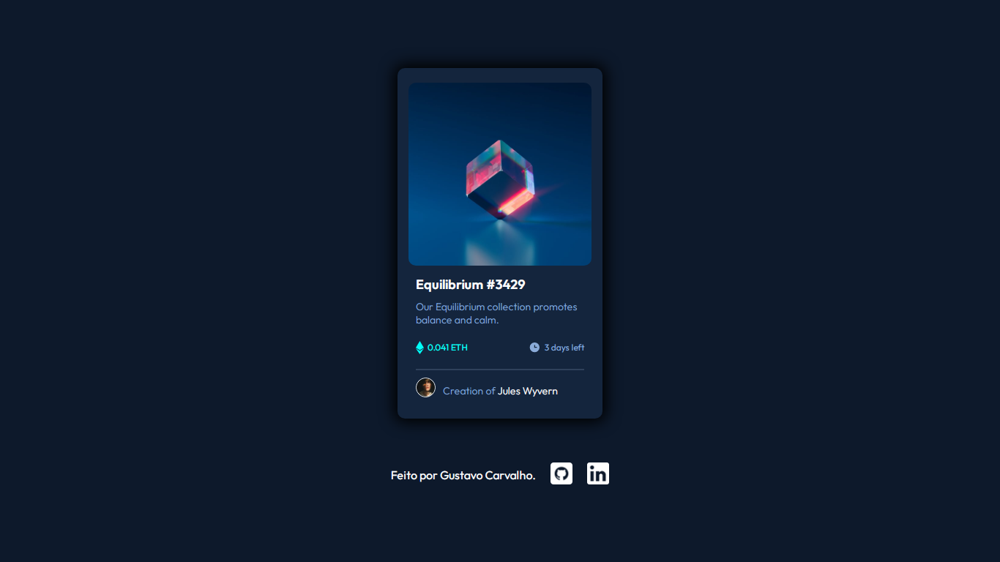
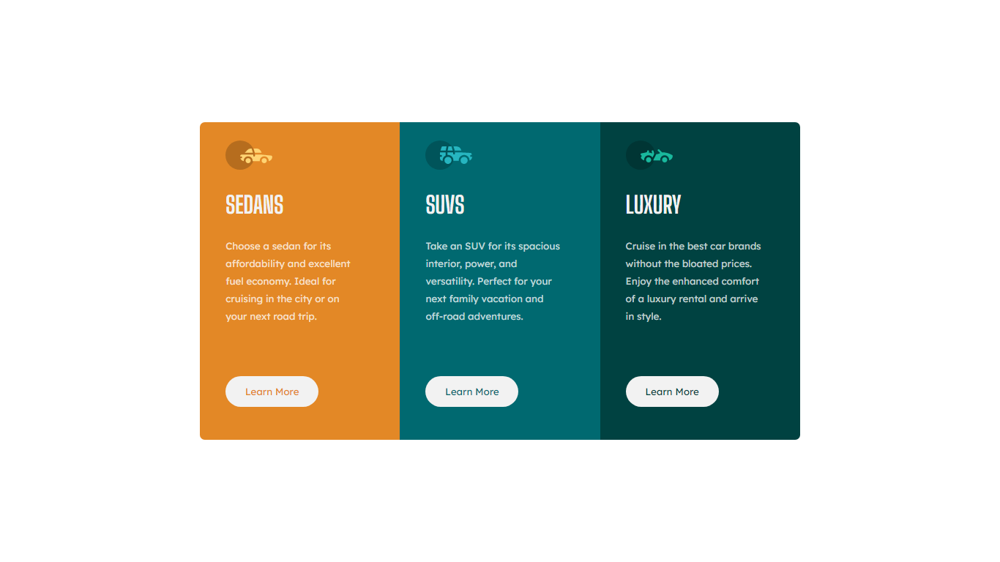

# Desafios do FrontEnd-Mentor
Front End Mentor é uma plataforma onde fornece desafios de front-end que incluem designs de web profissionais. Isso permite que qualquer pessoa pratique a construção de sites em um fluxo de trabalho realista. Aceitar esses desafios ajuda a melhorar habilidades, ganhar experiência na criação de sites e construir um portfólio de projetos incrível.

<table border="1">
  <tr>
    <td>
        <h3 align="center">Desafio 01</h3>
        <li><a href="https://github.com/nomegustaa/nomegustaa.github.io/tree/main/desafio-01" target="_blank"> Código</a></li> 
        <li><a href="https://nomegustaa.github.io/desafio-01/" target="blank"> Site</a></li> 
        
        
 Linguagens utilizadas 

        

          
          
        

    </td>
        <td>
        <h3 align="center">Desafio 02</h3>
        <li><a href="https://github.com/nomegustaa/nomegustaa.github.io/tree/main/Desafio-02" target="_blank"> Código</a></li> 
        <li><a href="https://nomegustaa.github.io/Desafio-02/desafio02.html" target="blank"> Site</a></li> 
        
        
 Linguagens utilizadas 

        

          
          
        

    </td>
  </tr>
</table>

<table border="1">
  # Loja PopStore projeto da faculdade
Uma loja simples e fictícia feito em HTML, CSS E JAVASCRIPT para o projeto da faculdade.
  <tr>
    <td>
        <h3 align="center">Desafio 01</h3>
        <li><a href="https://github.com/nomegustaa/nomegustaa.github.io/tree/main/desafio-01" target="_blank"> Código</a></li> 
        <li><a href="https://nomegustaa.github.io/desafio-01/" target="blank"> Site</a></li> 
        
        
 Linguagens utilizadas 

        

          
          
        

    </td>
  </tr>
</table>
